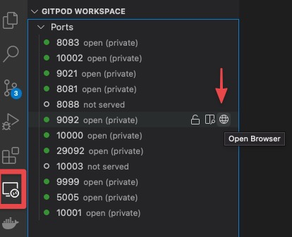
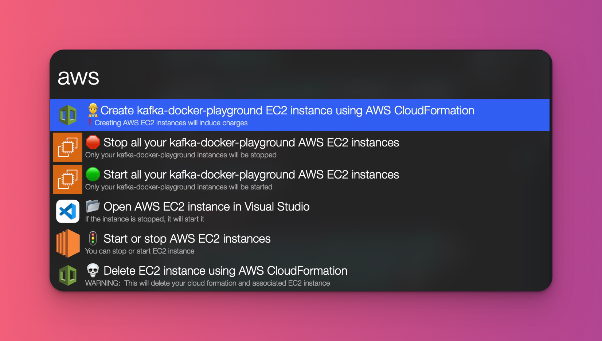
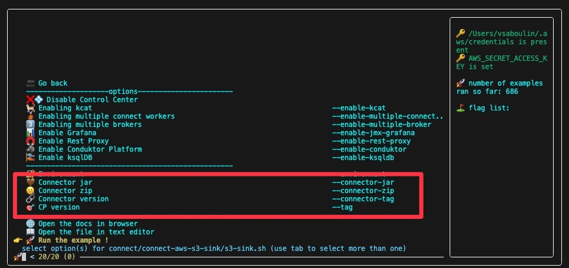
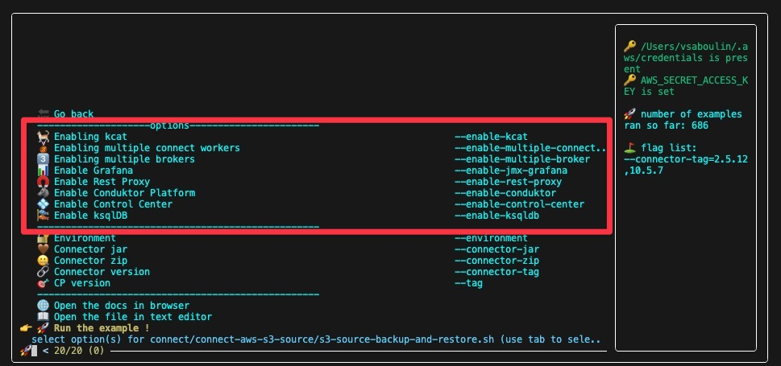
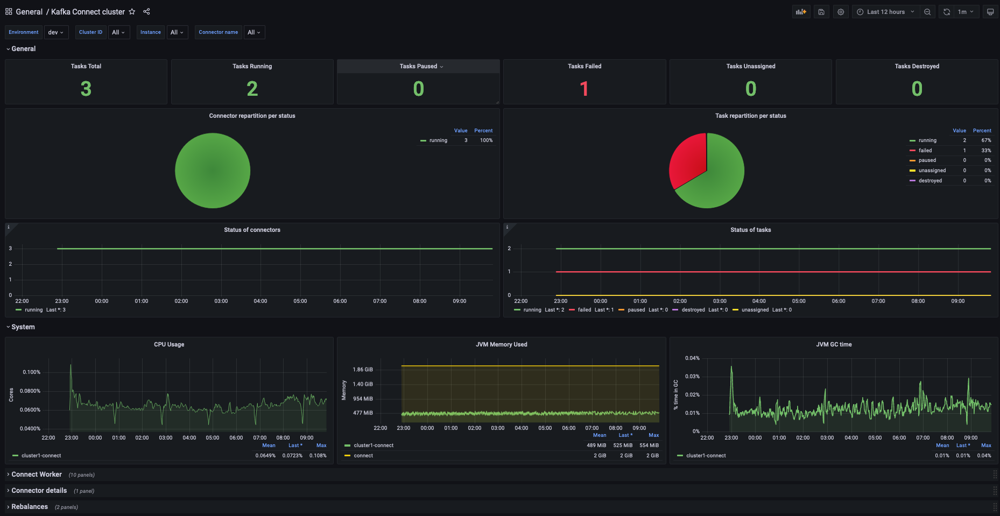
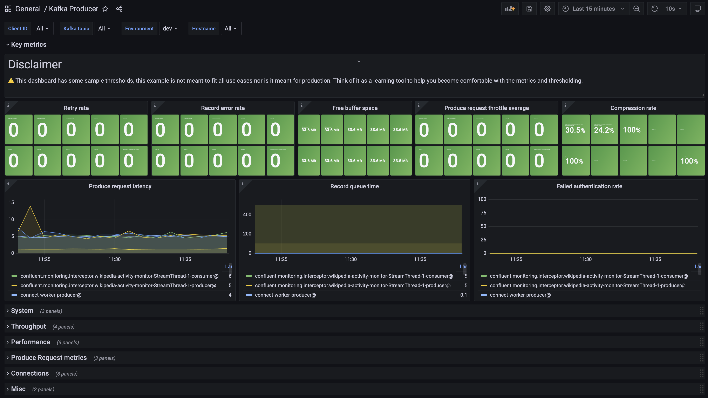
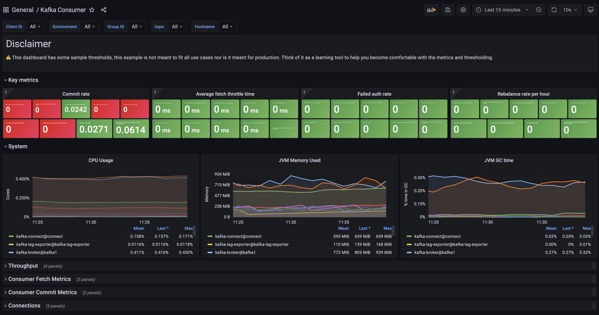

# 🚀 How to use

## 3️⃣ Ways to run

### 💻️ Locally

#### ☑️ Prerequisites

* You just need to have [docker](https://docs.docker.com/get-docker/) installed on your machine !

* Install the [🧠 CLI](/cli) by following [Setup](/cli?id=%f0%9f%9a%9c-setup)

* bash version 4 or higher is required. Mac users can upgrade bash with [brew](https://brew.sh/) by running `brew install bash`

* You also need internet connectivity when running connect tests as connectors are downloaded from Confluent Hub on the fly.

> [!NOTE]
> Every command used in the playground is using Docker, this includes `jq` (except if you have it on your host already), `aws`, `az`, `gcloud`, etc..
> 
> The goal is to have a consistent behavior and only depends on Docker.

> [!WARNING]
> The playground is only tested on macOS (including with [M1 *arm64* chip](/how-to-use?id=%f0%9f%a7%91%f0%9f%92%bb-m1-chip-arm64-mac-support)) and Linux (Ubuntu and Amazon Linux) . It is not tested on Windows, but it should be working with WSL.

> [!ATTENTION]
> On MacOS, the [Docker memory](https://docs.docker.com/desktop/mac/#resources) should be set to at least 8Gb.

#### 🧑‍💻 M1 chip (ARM64) Mac Support

Examples in the playground have been tested on best effort (since it is a manual process) on M1 Mac (arm64).

arm64 support results are displayed in **[Content](/content.md)** section:

Example:


The badges are:

* : example works natively.
* : example **cannot work at all**. You will need to run it using [Gitpod.io](/how-to-use?id=🪄-gitpodio) for example.
* : example is working but emulation is required. 

Docker Desktop now provides **Rosetta 2** virtualization feature, see detailed steps [here](https://levelup.gitconnected.com/docker-on-apple-silicon-mac-how-to-run-x86-containers-with-rosetta-2-4a679913a0d5) on how to enable it, basically, you need to enable this:


#### 🔽 Clone the repository

```bash
git clone --depth 1 https://github.com/vdesabou/kafka-docker-playground.git
```

> [!TIP]
> Specifying `--depth 1` only get the latest version of the playground, which reduces a lot the size of the download.

### 🪄 Gitpod.io

You can run the playground directly in your browser (*Cloud IDE*) using [Gitpod.io](https://gitpod.io) workspace by clicking on the link below:

[](https://gitpod.io/#https://github.com/vdesabou/kafka-docker-playground)

Look at *✨awesome✨* this is 🪄 !


> [!TIP]
> 50 hours/month can be used as part of the [free](https://www.gitpod.io/pricing) plan.

You can login into Control Center (port `9021`) by clicking on `Open Browser` option in pop-up:


Or select `Remote Explorer` on the left sidebar and then click on the `Open Browser` option corresponding to the port you want to connect to:



You can set your own environment variables in gitpod, see this [link](https://www.gitpod.io/docs/environment-variables#user-specific-environment-variables).

### ☁️ AWS EC2 instance (using Cloud Formation)

If you want to run the playground on an EC2 instance, you can use the AWS Cloud Formation [template](https://github.com/vdesabou/kafka-docker-playground/blob/master/cloudformation/kafka-docker-playground.json).

More details [here](https://github.com/vdesabou/kafka-docker-playground/tree/master/cloudformation).

### 🎩 AWS EC2 Alfred workflow

* ✨ Create and manage AWS EC2 instances to run kafka-docker-playground

* 🪄 Open EC2 instances directly in Visual Studio code using [Remote Development](https://code.visualstudio.com/docs/remote/ssh) (over SSH)


❗ You need [Alfred](https://www.alfredapp.com) [Powerpack](https://www.alfredapp.com/shop/) to be able to use that workflow.

#### 🎯 Commands available



👉 [Download workflow](https://github.com/vdesabou/kafka-docker-playground/raw/master/cloudformation/aws-ec2-kafka-docker-playground.alfred5workflow)


## 🏎️ Start an example

Check the list of examples in the **[Content](/content.md)** section and simply use [playground run](/playground%20run) CLI command!


> [!NOTE]
> When some environment variables are required, it is specified in the corresponding `README` file
> 
> Examples:
> 
> * [AWS S3 sink connector](https://github.com/vdesabou/kafka-docker-playground/tree/master/connect/connect-aws-s3-sink#aws-setup): file `~/.aws/credentials` or environnement variables `AWS_REGION`, `AWS_ACCESS_KEY_ID` and `AWS_SECRET_ACCESS_KEY` are required.
> 
> * [Zendesk source connector](https://github.com/vdesabou/kafka-docker-playground/tree/master/connect/connect-zendesk-source#how-to-run): arguments `ZENDESK_URL`, `ZENDESK_USERNAME`and `ZENDESK_PASSWORD` are required (you can also pass them as environment variables)
>

If there are missing environment variables, you'll need to fix it:

[](https://asciinema.org/a/643687)

## 🌤️ Confluent Cloud examples

Simply use [playground run](/playground%20run) command !

[](https://asciinema.org/a/643690)

All you have to do is to be already logged in with [confluent CLI](https://docs.confluent.io/confluent-cli/current/overview.html#confluent-cli-overview).

By default, a new Confluent Cloud environment with a Cluster will be created.

In case you want to use your own existing cluster, you can setup these environment variables (or set it up using playground run](/playground%20run) command):

* `ENVIRONMENT`: The environment id where your cluster is located (example: `txxxxx`) 
* `CLUSTER_NAME`: The cluster name
* `CLUSTER_CLOUD`: The Cloud provider (possible values: `aws`, `gcp` and `azure`)
* `CLUSTER_REGION`: The Cloud region
* `CLUSTER_CREDS`: The Kafka api key and secret to use, it should be separated with colon (example: `<API_KEY>:<API_KEY_SECRET>`)
* `SCHEMA_REGISTRY_CREDS` (optional, if not set, new one will be created): The Schema Registry api key and secret to use, it should be separated with colon (example: `<SR_API_KEY>:<SR_API_KEY_SECRET>`)

## 🪄 Specify versions

[playground run](/playground%20run) command allows you to do that very easily !



### 🎯 For Confluent Platform (CP)

By default, latest Confluent Platform version is used.

> [!TIP]
> You can also change cp version while running an example using [playground update-version](/playground%20update-version)

### 🔗 For Connectors

By default, for each connector, the latest available version on [Confluent Hub](https://www.confluent.io/hub/) is used. 

The only 2 exceptions are:

* replicator which is using same version as CP (but you can force a version using `REPLICATOR_TAG` environment variable)
* JDBC which is using same version as CP (but only for CP version lower than 6.x)

Each latest version used is specified on the [Connectors list](/content?id=connectors).

The playground has 3 different ways to use different connector version when running a connector example:

1. Specify the connector version

2. Specify a connector ZIP file

3. Specify a connector JAR file

*Example:*

```bash
00:33:47 ℹ️ 🎯 CONNECTOR_JAR is set with /tmp/kafka-connect-http-1.3.1-SNAPSHOT.jar
/usr/share/confluent-hub-components/confluentinc-kafka-connect-http/lib/kafka-connect-http-1.2.4.jar
00:33:48 ℹ️ 👷 Building Docker image confluentinc/cp-server-connect-base:cp-6.2.1-kafka-connect-http-1.2.4-kafka-connect-http-1.3.1-SNAPSHOT.jar
00:33:48 ℹ️ Remplacing kafka-connect-http-1.2.4.jar by kafka-connect-http-1.3.1-SNAPSHOT.jar
```

When jar to replace cannot be found automatically, the user is able to select the one to replace automatically:

```bash
11:02:43 ℹ️ 🎯 CONNECTOR_JAR is set with /tmp/debezium-connector-postgres-1.4.0-SNAPSHOT.jar
ls: cannot access '/usr/share/confluent-hub-components/debezium-debezium-connector-postgresql/lib/debezium-connector-postgresql-1.4.0.jar': No such file or directory
11:02:44 ❗ debezium-debezium-connector-postgresql/lib/debezium-connector-postgresql-1.4.0.jar does not exist, the jar name to replace could not be found automatically
11:02:45 ℹ️ Select the jar to replace:
1) debezium-api-1.4.0.Final.jar
2) debezium-connector-postgres-1.4.0.Final.jar
3) debezium-core-1.4.0.Final.jar
```

> [!WARNING]
> You can use both `--connector-tag` and `--connector-jar` at same time (along with `--tag`), but `--connector-tag` and `--connector-zip` are mutually exclusive.

> [!NOTE]
> For more information about the Connect image used, check [here](/how-it-works?id=🔗-connect-image-used).

> [!TIP]
> You can also change connector(s) version(s) while running an example using [playground update-version](/playground%20update-version)

## ⛳ Options

Selecting options is really easy with [playground run](/playground%20run) menu:



### 🚀 Enabling ksqlDB

By default, [`ksqldb-server`](https://github.com/vdesabou/kafka-docker-playground/blob/7098800a582bfb2629005366b514a923d2fa037f/environment/plaintext/docker-compose.yml#L135-L171) and [`ksqldb-cli`](https://github.com/vdesabou/kafka-docker-playground/blob/7098800a582bfb2629005366b514a923d2fa037f/environment/plaintext/docker-compose.yml#L173-L183) containers are not started for every test.

You can enable this by setting environment variable `ENABLE_KSQLDB=1` in your shell.

### 💠 Enabling Control Center

By default, [`control-center`](https://github.com/vdesabou/kafka-docker-playground/blob/7098800a582bfb2629005366b514a923d2fa037f/environment/plaintext/docker-compose.yml#L185-L221) container is not started for every test. 


You can enable this by setting environment variable `ENABLE_CONTROL_CENTER=1` in your shell.

Control Center is reachable at http://127.0.0.1:9021

### 🐺 Enabling Conduktor Platform

By default, [`Conduktor Platform`](https://www.conduktor.io) container is not started for every test. 

You can enable this by setting environment variable `ENABLE_CONDUKTOR=1` in your shell.

Conduktor is reachable at [http://127.0.0.1:8080/console](http://127.0.0.1:8080/console) (`admin`/`admin`).

### 3️⃣ Enabling multiple brokers

By default, there is only one kafka node enabled. To enable a three node count, select it in menu.

### 🥉 Enabling multiple connect workers

By default, there is only one connect node enabled. To enable a three connect node count, select it in menu.

> [!WARNING]
> It only works when [plaintext](https://github.com/vdesabou/kafka-docker-playground/tree/master/environment/plaintext) environment is used.

### 📊 Enabling JMX Grafana

By default, Grafana dashboard using JMX metrics is not started for every test.

You can enable this by setting environment variable `ENABLE_JMX_GRAFANA=1` in your shell.

📊 Grafana is reachable at [http://127.0.0.1:3000](http://127.0.0.1:3000)
🛡️ Prometheus is reachable at [http://127.0.0.1:9090](http://127.0.0.1:9090)
📛 [Pyroscope](https://pyroscope.io/docs/) is reachable at [http://127.0.0.1:4040](http://127.0.0.1:4040)

#### Grafana dashboards

List of provided dashboards:
 - Confluent Platform overview
 - Zookeeper cluster
 - Kafka cluster
 - Kafka topics
 - Kafka quotas
 - Schema Registry cluster
 - Kafka Connect cluster
 - ksqlDB cluster
 - Kafka Clients
 - Kafka lag exporter
 - Cluster Linking
 - Kafka streams RocksDB
 - Oracle CDC source Connector


<!-- tabs:start -->

##### **Confluent Platform overview**


#### **Zookeeper cluster**


#### **Kafka cluster**


#### **Kafka topics**


#### **Kafka quotas**

For Kafka to output quota metrics, at least one quota configuration is necessary.

A quota can be configured using:

```bash
docker exec broker kafka-configs --bootstrap-server broker:9092 --alter --add-config 'producer_byte_rate=10000,consumer_byte_rate=30000,request_percentage=0.2' --entity-type users --entity-name unknown --entity-type clients --entity-name unknown
```


#### **Schema Registry cluster**


#### **Kafka Connect cluster**




#### **ksqlDB cluster**


#### **Kafka streams RocksDB**


#### **Kafka Clients**





#### **Oracle CDC source Connector**


<!-- tabs:end -->


### 🐈‍⬛ Enabling kcat

By default, [edenhill/kcat](https://github.com/edenhill/kcat) is not started for every test. 

You can enable this by setting environment variable `ENABLE_KCAT=1` in your shell.

Then you can use it with:

```bash
docker exec kcat kcat -b broker:9092 -L
```


## 🔢 JMX Metrics

JMX metrics are available locally on those ports:

* zookeeper: `9999`
* broker: `10000`
* schema-registry: `10001`
* connect: `10002`

In order to easily gather JMX metrics, you can execute [🧠 CLI](/cli) with `get-jmx-metrics` command:

```bash
$ playground get-jmx-metrics

  Get JMX metrics from a component.
  
  Check documentation /how-to-use?id=%f0%9f%94%a2-jmx-metrics

Usage:
  playground get-jmx-metrics [OPTIONS]
  playground get-jmx-metrics --help | -h

Options:
  --component, -c COMPONENT
    Component name.
    Allowed: zookeeper, broker, connect, schema-registry
    Default: connect

  --domain, -d DOMAIN
    Domain name.

  --help, -h
    Show this help

Examples:
  playground get-jmx-metrics --component connect
  playground get-jmx-metrics --component connect --domain "kafka.connect
  kafka.consumer kafka.producer"
  playground get-jmx-metrics -c broker
```

Example (without specifying domain):

```bash
$ playground get-jmx-metrics -c connect
17:35:35 ❗ You did not specify a list of domains, all domains will be exported!
17:35:35 ℹ️ This is the list of domains for component connect
JMImplementation
com.sun.management
java.lang
java.nio
java.util.logging
jdk.management.jfr
kafka.admin.client
kafka.connect
kafka.consumer
kafka.producer
17:35:38 ℹ️ JMX metrics are available in /tmp/jmx_metrics.log file
```

Example (specifying domain):

```bash
$ playground get-jmx-metrics -c connect -d "kafka.connect kafka.consumer kafka.producer"
17:38:00 ℹ️ JMX metrics are available in /tmp/jmx_metrics.log file
```

> [!WARNING]
> Local install of Java `JDK` (at least 1.8) is required to run `playground get-jmx-metrics`

## 📝 See properties file

Because the playground use **[Docker override](/how-it-works?id=🐳-docker-override)**, not all configuration parameters are in same `docker-compose.yml` file.

In order to easily see the end result properties file, you can use execute [playground container get-properties](/playground%20container%20get-properties) command

*Example:*

```bash
$ playground get-properties -c connect
bootstrap.servers=broker:9092
config.providers.file.class=org.apache.kafka.common.config.provider.FileConfigProvider
config.providers=file
config.storage.replication.factor=1
config.storage.topic=connect-configs
connector.client.config.override.policy=All
consumer.confluent.monitoring.interceptor.bootstrap.servers=broker:9092
consumer.interceptor.classes=io.confluent.monitoring.clients.interceptor.MonitoringConsumerInterceptor
group.id=connect-cluster
internal.key.converter.schemas.enable=false
internal.key.converter=org.apache.kafka.connect.json.JsonConverter
internal.value.converter.schemas.enable=false
internal.value.converter=org.apache.kafka.connect.json.JsonConverter
key.converter=org.apache.kafka.connect.storage.StringConverter
log4j.appender.stdout.layout.conversionpattern=[%d] %p %X{connector.context}%m (%c:%L)%n
log4j.loggers=org.apache.zookeeper=ERROR,org.I0Itec.zkclient=ERROR,org.reflections=ERROR
offset.storage.replication.factor=1
offset.storage.topic=connect-offsets
plugin.path=/usr/share/confluent-hub-components/confluentinc-kafka-connect-http
producer.client.id=connect-worker-producer
producer.confluent.monitoring.interceptor.bootstrap.servers=broker:9092
producer.interceptor.classes=io.confluent.monitoring.clients.interceptor.MonitoringProducerInterceptor
rest.advertised.host.name=connect
rest.port=8083
status.storage.replication.factor=1
status.storage.topic=connect-status
topic.creation.enable=true
value.converter.schema.registry.url=http://schema-registry:8081
value.converter.schemas.enable=false
value.converter=io.confluent.connect.avro.AvroConverter
```

## ♻️ Re-create containers

Because the playground uses **[Docker override](/how-it-works?id=🐳-docker-override)**, not all configuration parameters are in same `docker-compose.yml` file and also `docker-compose` files in the playground depends on environment variables to be set.

For these reasons, if you want to make a change in one of the `docker-compose` files (without restarting the example from scratch), it is not simply a matter of doing `docker-compose up -d` 😅!

However, when you execute an example, you get in the output the [playground container recreate](/playground%20container%20recreate) in order to easily re-create modified container(s) 🥳.

*Example:*

```bash
12:02:18 ℹ️ ✨If you modify a docker-compose file and want to re-create the container(s),
 run cli command playground container recreate
```

So you can modify one of the `docker-compose` files (in that case either [`environment/plaintext/docker-compose.yml`](https://github.com/vdesabou/kafka-docker-playground/blob/master/environment/plaintext/docker-compose.yml) or [`connect/connect-http-sink/docker-compose.plaintext.yml`](https://github.com/vdesabou/kafka-docker-playground/blob/master/connect/connect-http-sink/docker-compose.plaintext.yml)), and then run execute [🧠 CLI](/cli) with `playground container recreate` command:

*Example:*

After editing [`connect/connect-http-sink/docker-compose.plaintext.yml`](https://github.com/vdesabou/kafka-docker-playground/blob/master/connect/connect-http-sink/docker-compose.plaintext.yml) and updated both `connect` and `http-service-no-auth`, the suggested cli command was ran:

```bash
$ playground container recreate
http-service-ssl-basic-auth is up-to-date
http-service-oauth2-auth is up-to-date
Recreating http-service-no-auth ... 
zookeeper is up-to-date
http-service-no-auth-500 is up-to-date
http-service-mtls-auth is up-to-date
http-service-basic-auth-204 is up-to-date
http-service-basic-auth is up-to-date
broker is up-to-date
Recreating http-service-no-auth ... done
Recreating connect              ... done
control-center is up-to-date
```
